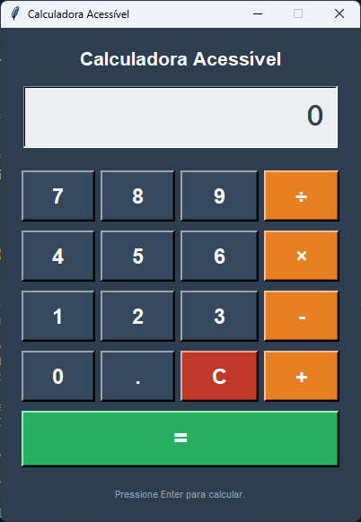
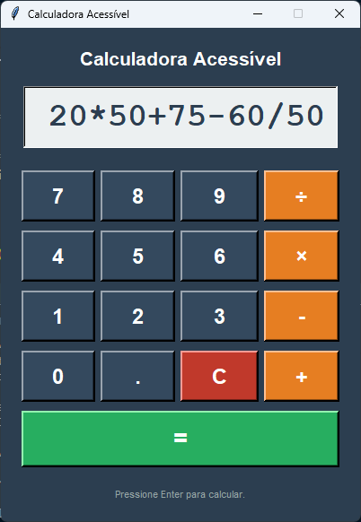
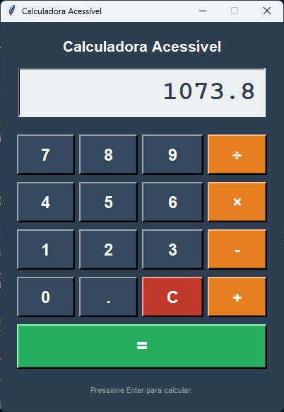

# 🧮 CalcMath

Uma calculadora acessível desenvolvida em Python utilizando Tkinter.
O projeto possui interface moderna, suporte a áudio e foco em acessibilidade e usabilidade.

---

# 📷 Fotos do Projeto

<p align="center">
  

  

  
</p>

---

# ✨ Funcionalidades

* ➕ Operações matemáticas básicas
* 🎨 Interface moderna
* 🔊 Resultado em áudio
* ⌨️ Suporte ao teclado
* 🛡️ Validação de expressões
* ❌ Tratamento de erros matemáticos
* 🧹 Limpeza rápida do visor

---

# 🚀 Tecnologias Utilizadas

* Python 3
* Tkinter
* pyttsx3

---

# 📦 Instalação

Clone o repositório:

```bash
git clone https://github.com/iLGuilhermeDev/calcmath.git
```

Entre na pasta do projeto:

```bash
cd calcmath
```

Instale as dependências:

```bash
pip install pyttsx3
```

Execute o programa:

```bash
python calculo.py
```

---

# 🎮 Controles

| Tecla     | Função          |
| --------- | --------------- |
| 0-9       | Inserir números |
| + - * /   | Operações       |
| Enter     | Calcular        |
| C         | Limpar          |
| Backspace | Apagar          |

---

# 📁 Estrutura do Projeto

```text
calcmath/
│
├── images/
│   ├── fotocalc.png
│   ├── fotocalc2.png
│   └── fotocalc3.png
│
├── calculo.py
├── README.md
└── .gitignore
```

---

# 🛠️ Melhorias Futuras

* Histórico de cálculos
* Calculadora científica
* Tema escuro/claro
* Exportação para `.exe`
* Mais acessibilidade

---
